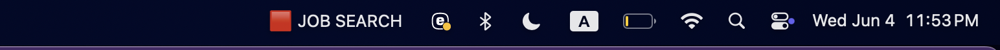
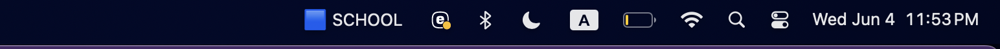

LabelSpace

LabelSpace is a macOS menu bar utility that displays custom labels for your virtual desktops (Spaces). macOS does not provide a native way to rename desktops, and LabelSpace fills that gap by showing a label in your menu bar to help you remember the purpose of each space (e.g., "SCHOOL", "JOB SEARCH").

---
## Example Menu Bar Labels

Here are three example screenshots showing how the desktop labels appear in the macOS menu bar:






Each space has:
- A custom label (e.g., “SCHOOL” or “JOB SEARCH”)
- A color-coded icon to make it visually distinctive
- Live updates based on which desktop (Space) is currently active

This gives you persistent awareness of your current context, directly from the menu bar.

---

## Features

- Show the name of your current desktop in the macOS menu bar
- Customize labels for each Space via a simple Python list
- Updates automatically when switching desktops
- Lightweight and persistent
- Built with Python and the `rumps` menu bar library

---

## Installation

### 1. Install yabai

LabelSpace uses yabai to get the current space index.

```
brew install koekeishiya/formulae/yabai
```

Start the service:

```
brew services start yabai
```

Make sure you grant yabai accessibility permissions in:
System Settings → Privacy & Security → Accessibility

### 2. Set up the Python environment

Navigate to your LabelSpace folder and run:

```
python3 -m venv venv
source venv/bin/activate
pip install rumps
```

### 3. Run LabelSpace

Run it using:

```
nohup python LabelSpace.py &
```

This keeps it running in the background even if you close VSCode or the terminal.

---

## Customization

Open `LabelSpace.py` and find the `SPACE_LABELS` list:

```
SPACE_LABELS = [
    "SCHOOL",
    "PERSONAL",
    "JOB SEARCH",
    "LASSO"
]
```

Change the values to match your own preferred labels. Each label maps to a corresponding Space index from yabai.

---

## Development Roadmap

### Optimization

 Only update the menu bar title when the space actually changes (avoid redundant redraws)
 Reduce subprocess usage by caching results
 Adjust polling frequency for better efficiency

### Native Integration

 Bundle as a macOS `.app` using Platypus or py2app
 Add to Login Items for automatic startup
 Add optional floating overlay when changing Spaces with large, styled labels

### Future Features

 GUI for editing labels
 Config file support
 Hotkey integration with `skhd`
 Space-specific automation (e.g., launch apps or set wallpaper per space)

---

## Uninstall

If running with `nohup`, find and kill the process:

```bash
ps aux | grep LabelSpace.py
kill <PID>
```

Or simply reboot.

---

## File Structure

```
LabelSpace/
├── LabelSpace.py       # Main script
├── README.md           # This file
└── venv/               # Python virtual environment (optional)
```
---
Here’s the section you can add to your README:

---

##  Prevent macOS from Reordering Desktops Automatically

By default, macOS Mission Control will automatically rearrange your Desktops (Spaces) based on which one you use most recently. This can cause issues if you’re labeling desktops and expect them to stay in a fixed order.

To **disable this behavior**, run the following command in Terminal:

```
defaults write com.apple.dock mru-spaces -bool false && killall Dock
```

###  What this does:

* `mru-spaces -bool false` tells macOS **not to reorder Spaces automatically**.
* `killall Dock` restarts the Dock so the setting takes effect immediately.

If you ever want to re-enable automatic rearranging:

```
defaults write com.apple.dock mru-spaces -bool true && killall Dock
```

This setting ensures that your custom-labeled Spaces remain in a consistent, manual order — critical if you're relying on them for focused workflows or visual overlays.

---

## License

MIT License. See `LICENSE` file.

---

## Author

Created by Michael Warshowsky. Feedback and contributions welcome.

